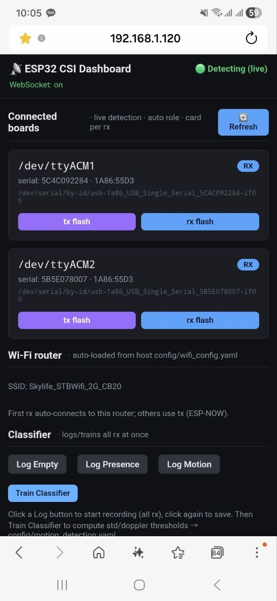
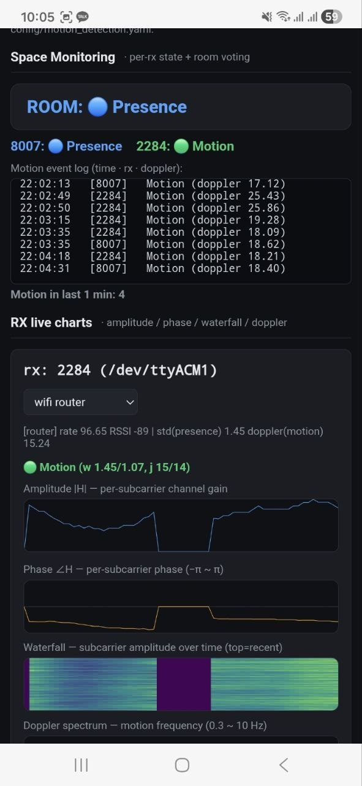
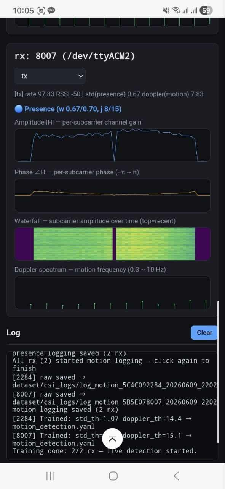
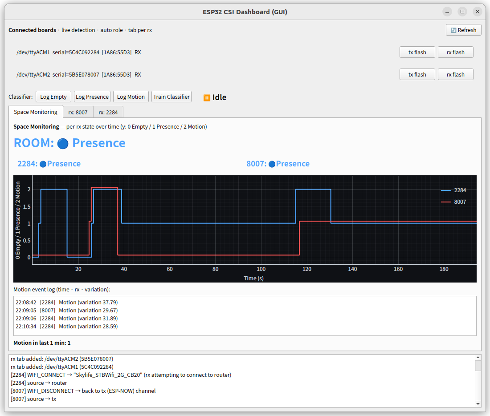
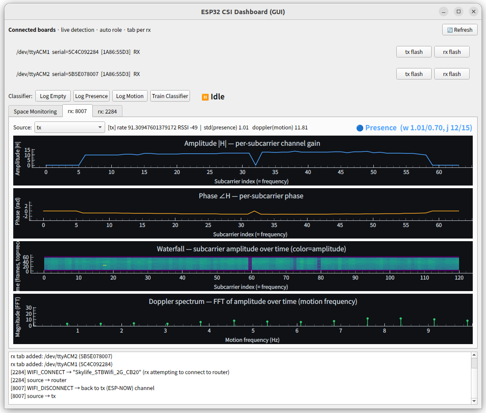
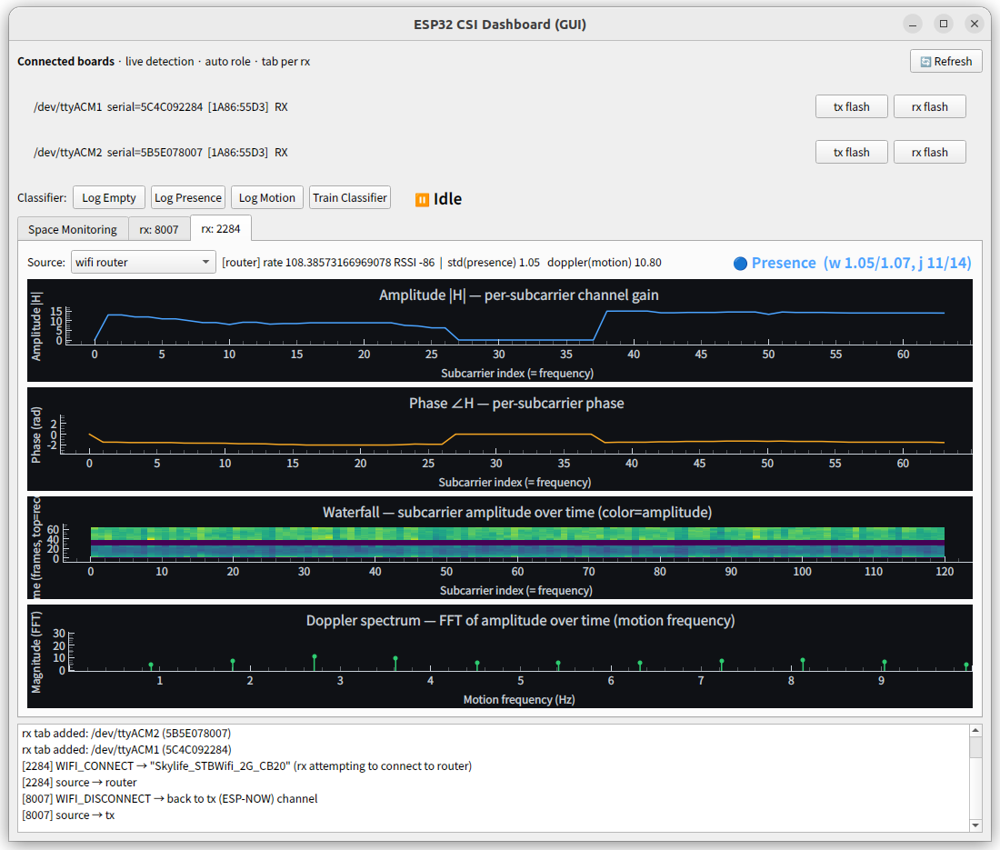
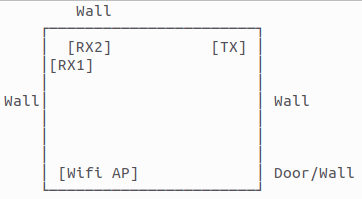

# csi — CSI 데이터 획득 계층

WiFi **CSI**(Channel State Information)를 ESP32-S3 로 수집하는 계층입니다.
펌웨어(송신/수신) + 호스트 측 공용 백엔드·수집·파싱·웹/GUI 대시보드를 포함합니다.

> 이 계층은 **데이터 획득**까지만 책임집니다. presence / 다중 인원 / pose / 위치
> 추정의 **응용 계층**은 [`../sensing/`](../sensing/) 에 있습니다.
> (목표: 카메라·기타 센서 없이 WiFi CSI 만으로 실내 다중 인원 감지 + 자세/위치 추정.)

rx 의 `csi_recv` 는 **통합 수신 펌웨어**로, 한 펌웨어가 두 신호원의 CSI 를 모두
수집합니다 — **tx 의 ESP-NOW broadcast CSI**(라우터 불필요, 전용 tx↔rx 페어)와
**라우터(AP)의 CSI**(STA 접속 후 게이트웨이 ping). 호스트(GUI/web)가 신호원
(`tx` / `wifi router` / `all`)을 골라 분석하므로 신호원을 바꿔도 **재flash 가
필요 없습니다**. 보드는 펌웨어가 부팅 시 출력하는 **`DEVICE_ROLE` 로 tx/rx 를 자동
감지**하므로, 디바이스 매핑 파일(config_devices.yaml)이 필요 없습니다 — **연결만
하면** 호스트가 알아봅니다.

라우터 CSI 를 쓸 때 라우터 자격증명은 **펌웨어에 박지 않고 런타임 시리얼 주입**합니다.
호스트가 `config/wifi_config.yaml`(없으면 사용자 입력)을 읽어 `WIFI_CONNECT <ssid>\t<pw>`
명령을 rx 로 보내면, rx 가 라우터에 STA 접속 + 게이트웨이 ping 으로 라우터 CSI 를
수집합니다. `WIFI_DISCONNECT` 로 tx(ESP-NOW 채널)로 복귀합니다.

## 구조

```
csi/
├── firmware/
│   ├── csi_recv/   # 통합 수신 펌웨어 — rx. tx(ESP-NOW) + 라우터(AP) CSI 둘 다 수집. 부팅 시 DEVICE_ROLE 출력
│   └── csi_send/   # 송신 펌웨어(ESP-NOW 패킷 송신) — tx. 부팅 시 DEVICE_ROLE 출력
├── common/         # web/GUI 공용 백엔드(UI 프레임워크 무관)
│   ├── boards.py        # 보드 실시간 감지(by-id) — board_check usb_detector 재사용
│   ├── role_detect.py   # 시리얼 DEVICE_ROLE → tx/rx 자동 판별
│   ├── csi_stream.py    # CSI_DATA → 진폭/위상 스트림
│   ├── flasher.py       # role 펌웨어 빌드/flash (csi_flash.sh 래퍼)
│   └── port_lock.py     # 포트 직렬화 락
├── web/            # 웹 대시보드(FastAPI): 보드 감지·role·tx/rx flash·진폭/위상 라이브
├── gui/            # 데스크톱 GUI(PyQt5+pyqtgraph): web 과 동일 백엔드
├── collect/serial_collector.py  # 시리얼 CSI 라인 → CSV 저장 (--role 실시간 감지)
└── analysis/csi_parser.py       # CSV → 진폭/위상 배열 파싱
```

## 빠른 시작 (보드 연결만 하면 됨)

보드를 USB 로 연결하면 호스트가 실시간 감지하고 `DEVICE_ROLE` 로 tx/rx 를 표시합니다.

```bash
# 웹 대시보드 — 보드 감지 + tx/rx 다운로드 + CSI 진폭/위상 라이브
bash scripts/csi_app.sh           # http://127.0.0.1:8200

# 또는 데스크톱 GUI (동일 기능)
bash scripts/csi_gui.sh
```

대시보드에서 각 보드에 **tx 또는 rx 펌웨어를 골라 다운로드**하고, rx 를 선택해 **CSI
진폭/위상·워터폴·도플러 스펙트럼**을 실시간으로 봅니다. **신호원 콤보(tx / wifi router /
all)** 로 분석 대상을 고르며, `wifi router` 선택 시 `config/wifi_config.yaml`(없으면
직접 입력)의 자격증명을 rx 에 주입해 라우터 CSI 를 수집합니다. 사람이 **tx–rx 사이
(2~5m 권장)** 를 지나가면 파형이 변합니다(붙여 두면 감지 영역이 없어 변화가 안 보입니다).

라우터 CSI 는 stream open(=보드 리셋) 직후 보내는 `WIFI_CONNECT` 1회가 부팅 중 씹혀
못 붙는 일이 있어, **router CSI 가 실제로 들어올 때까지 주기 재전송**합니다(web/GUI 동일).
학습된 신호원이 있으면 rx 추가 시 그 값으로 기본 선택합니다(예: 8007=tx, 2284=router).

## 실시간 3상태 인지 + 로깅·학습

web/GUI 둘 다 **동일한 공용 백엔드**([`common/classifier.py`](common/classifier.py))로
3상태(`empty` / `presence` / `motion`)를 판정합니다 — 같은 CSI 패킷이면 두 프런트의
std/doppler/상태가 **100% 일치**합니다. 두 메트릭으로 판정합니다:

- **presence = 진폭 std** — 사람 유무(호흡·멀티패스 변화)에 반응
- **motion = 도플러 피크** — 워터폴 시간축 FFT(0.3~10Hz)의 최대 세기(움직임 주파수)

히스테리시스(진입↔이탈 임계 분리) + outlier 필터(연속 N회 같은 결과여야 확정)로
경계 진동·순간 노이즈를 억제하고, 다중 rx 는 **voting**(활성 링크 ≥2 면 2표, 1개면
1표)으로 최종 방 상태를 정합니다.

**로깅 → 학습 흐름**: `Log Empty/Presence/Motion` 으로 상태별 raw CSI 를
`dataset/csi_logs/log_<상태>_<serial>_<ts>.csv` 로 저장하고(모든 rx 동시), `Train
Classifier` 로 상태별 **가장 최근** CSV 에서 임계(std_th/doppler_th)를 계산해
`config/motion_detection.yaml` 에 저장한 뒤 바로 실시간 인지로 전환합니다.
GUI 없이 일괄 재학습하려면 `python csi/train_from_dataset.py`.

```
std_th     = (Empty 평균 + Presence 평균) / 2      # Empty↔Presence 경계
doppler_th = (Presence 평균 + Motion 평균) / 2     # Presence↔Motion 경계
```

### 화면 예시

**web 대시보드**(모바일 브라우저) — 보드/WiFi/분류기 · 방 상태 voting · rx 라이브 차트:

| 보드·WiFi·분류기 | 공간 모니터링 | rx 차트 |
|---|---|---|
|  |  |  |

**데스크톱 GUI**(PyQt5+pyqtgraph) — 공간 모니터링(상태 타임라인) · rx 진폭/위상/워터폴/도플러:

| 공간 모니터링 | rx 차트 1 | rx 차트 2 |
|---|---|---|
|  |  |  |

## 명령줄 도구

```bash
# 펌웨어 빌드/flash (대시보드가 내부적으로 호출하는 것과 동일)
bash scripts/csi_flash.sh --role rx --port /dev/ttyACM0   # 빌드+flash
bash scripts/csi_flash.sh --role tx --build-only          # 빌드만(merge-bin 산출)

# CSI 수집 → CSV (--role 은 연결 보드를 실시간 감지해 선택)
python csi/collect/serial_collector.py --role rx --out results/csi_run01.csv

# 파싱/확인
python csi/analysis/csi_parser.py results/csi_run01.csv
```

## 위치 정확도 (다중 rx 앵커)

CSI 로 **위치/다중 인원/pose** 정확도를 높이려면 **rx(수신/앵커) 보드를 여러 곳에
분산** 배치합니다(`tx 1 + rx 다수`). ESP32-S3 는 안테나 1개(SISO)라 **보드 분산이 곧
공간 다양성**입니다 — 링크(=tx×rx)가 많고 넓게 퍼질수록 정확해집니다. 여러 rx 의 CSI 를
모아 [`../sensing/`](../sensing/) 에서 위치/pose 를 추정합니다.

### 실내 HW 배치도(예시)

현재 검증 배치 — **고정 tx 1 + rx 2 + WiFi AP** 를 방 모서리에 분산해 4개 링크
(tx→rx1, tx→rx2, AP→rx1, AP→rx2)를 만듭니다. tx/AP 와 rx 를 마주보는 모서리로
띄워, 사람이 방 안을 지날 때 여러 링크가 겹쳐 변하게 합니다.



## 참고

- 각 하위 상세: [collect](collect/README.md) · [analysis](analysis/README.md) ·
  [web](web/README.md) · [firmware](firmware/README.md)
- 기반 코드: [espressif/esp-csi](https://github.com/espressif/esp-csi)
  (`reference/esp-csi`, Apache-2.0) 의 get-started / esp-radar 예제.
- (참고) reference esp-radar 의 PyQt GUI 동작 확인: `scripts/run_reference_csi_tool.sh`
