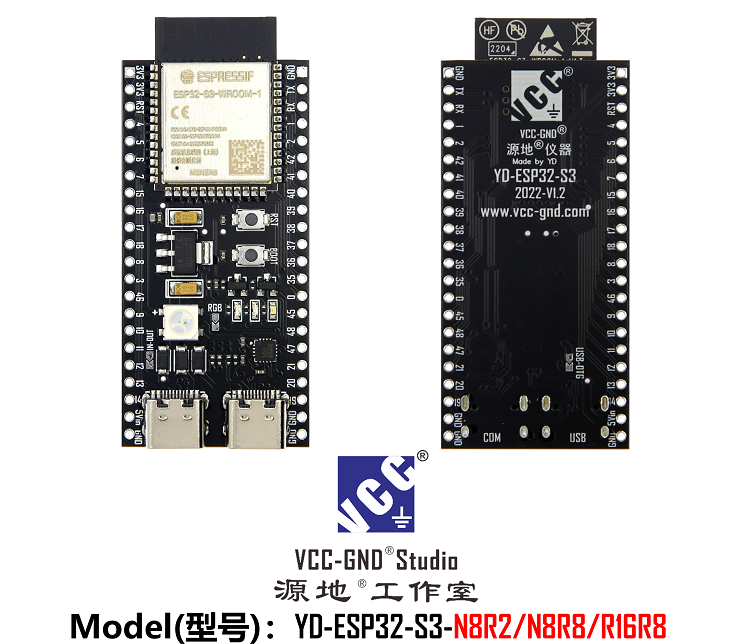
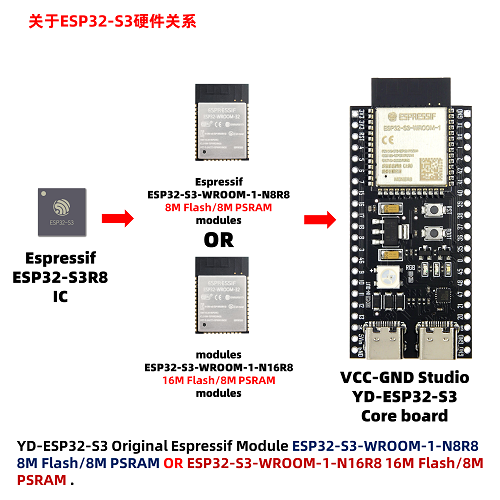
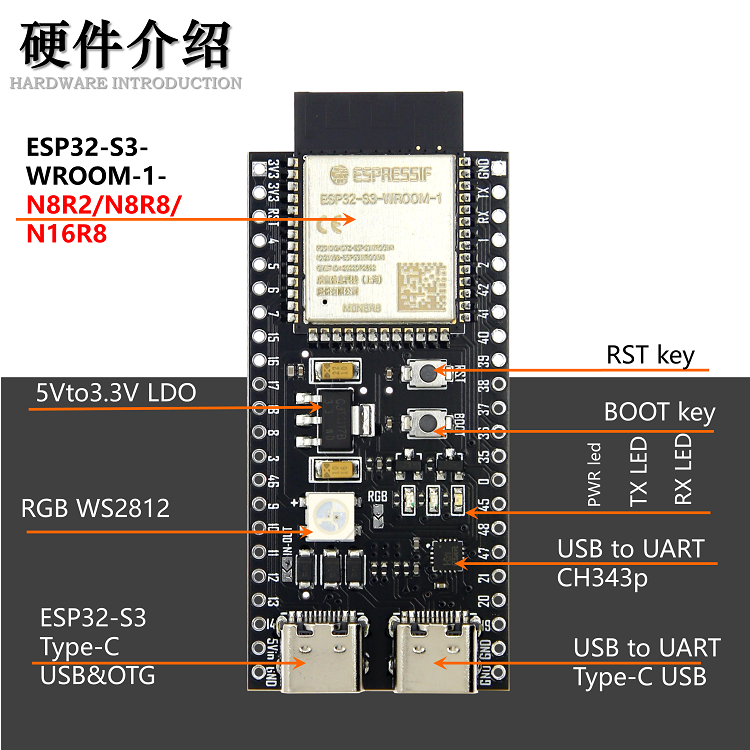
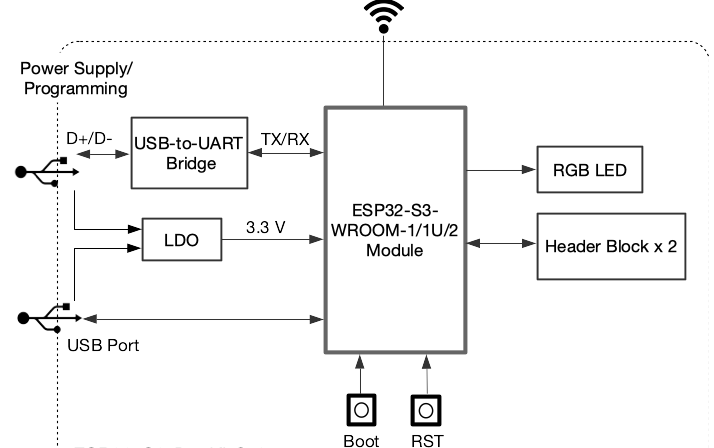
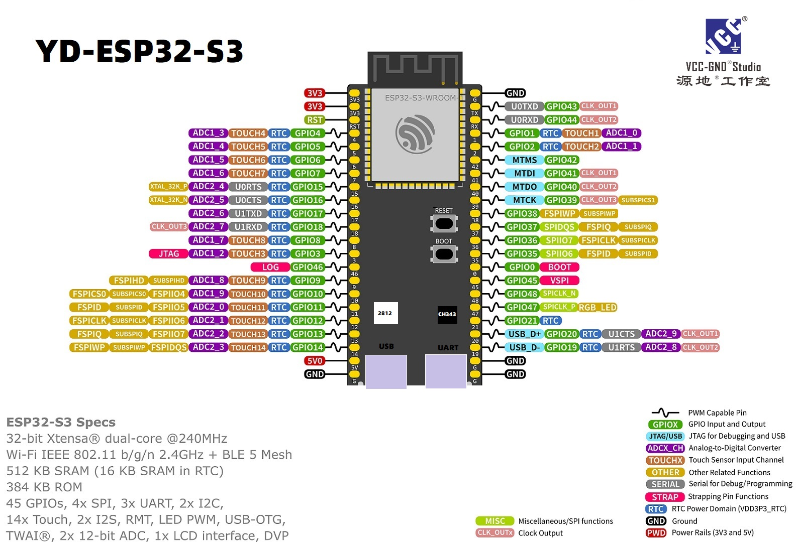
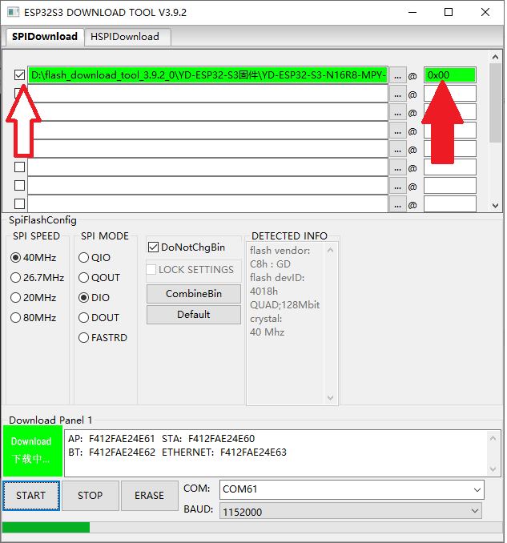

# YD-ESP32-S3 Core Board

**English** | [한국어](README.KR.md) | [中文](README.CH.md)

### Introduction

The YD-ESP32-S3 core board is designed by VCC-GND Studio (源地工作室). For purchase
inquiries, visit www.vcc-gnd.com. The board is built around the ESP32-S3 chip and is
suitable both as a prototyping board for IoT applications and for real deployments. It
provides **two USB Type-C ports**: one is a hardware USB-to-UART bridge (CH343P, made by
WCH / 沁恒), and the other is the ESP32-S3's native USB port.

This guide helps you get started quickly with the YD-ESP32-S3 and provides detailed
information about the board.

The YD-ESP32-S3 is an entry-level development board based on the ESP32-S3-WROOM-1 module,
which integrates Wi-Fi + Bluetooth® LE.

Most of the module's pins are broken out to pin headers on both sides of the board, so you
can easily connect peripherals with jumper wires or plug the board directly into a
breadboard.

1. This is a minimal ESP32-S3 core board, using an Espressif ESP32-S3 module.
2. It has a dedicated LDO circuit for the wireless subsystem, so you don't have to worry
   about insufficient current (power).
3. It includes a WS2812 RGB LED (note: it is **not** lit directly through a GPIO logic
   level — it is an addressable LED).
4. The RST button is used for external reset; the BOOT button (together with the RST button)
   can boot the chip into bootloader (download) mode, and after reset it can be used as a
   user button — it is GPIO0.
5. You'll notice the board has **two Type-C ports**: one is the direct USB connection
   (GPIO19 / GPIO20), and the other is the USB-to-UART port, which uses a hardware
   USB-to-UART bridge chip (CH343).

### Hardware Overview

| Main Component | Description |
| :------------- | ----------- |
| ESP32-S3-WROOM-1 | ESP32-S3-WROOM-1 is a general-purpose Wi-Fi + Bluetooth LE MCU module with rich peripheral interfaces, strong neural-network computing capability, and signal-processing capability, built for the AI and AIoT markets. ESP32-S3-WROOM-1 uses a PCB on-board antenna. |
| 5 V to 3.3 V LDO | Power converter: 5 V input, 3.3 V output, 1 A current. |
| Pin Headers | All usable GPIO pins (except the SPI bus used by the flash) are broken out to the board's pin headers. |
| USB-to-UART Port | Type-C USB port. Can be used to power the board, flash firmware to the chip, and communicate with the chip via the on-board USB-to-UART bridge. |
| Boot Button | Download button. Hold **Boot** and press **Reset** once to enter "firmware download" mode and flash firmware over the serial port. After boot it can be used as a regular input button — the IO used is GPIO0. |
| Reset Button | Reset button. |
| USB Port | ESP32-S3 USB OTG port, supporting the full-speed USB 1.1 standard. This native USB port can be used to power the board, flash firmware, communicate with the chip over USB, and for JTAG debugging. |
| USB-to-UART Bridge | The chip is the CH343P from WCH (沁恒). Website: http://www.wch-ic.com/ — Driver: http://www.wch-ic.com/products/CH343.html |
| RGB LED | Addressable RGB LED driven by GPIO48. Model: WS2812. |
| PWR LED | Power indicator LED. Lights up when the board is powered; it cannot be controlled by software. |
| TX LED | LED on the ESP32-S3 serial TXD line. Blinks when serial data is being transmitted. If you don't use the serial function, it can be used as a GPIO — GPIO43. |
| RX LED | LED on the ESP32-S3 serial RXD line. Blinks when serial data is being received. If you don't use the serial function, it can be used as a GPIO — GPIO44. |

### Note

On boards using the ESP32-S3-WROOM-1 module series with 8-line (octal) SPI flash/PSRAM,
pins **GPIO35, GPIO36, and GPIO37** are used internally for communication between the
ESP32-S3 chip and the SPI flash/PSRAM, and **must not be used externally**.

### Before You Start

Before applying power, make sure the board is intact and undamaged.

### Functional Block Diagram

The main components of the YD-ESP32-S3 and how they are connected are shown below:

### The Two USB-C Ports (Left vs. Right)

The board has two USB-C ports side by side at the bottom edge. They are **not**
interchangeable — each connects to a different chip and is used for different things.

> **Orientation:** hold the board with the components facing you and the two USB-C
> connectors at the **bottom** edge. The silkscreen labels next to each connector
> (**USB** and **COM**) are the definitive reference — if your board's layout differs,
> trust the labels over "left/right".

| | Left port | Right port |
|---|---|---|
| Silkscreen label | **USB** | **COM** (UART) |
| Connects to | ESP32-S3 **native USB** (USB-Serial-JTAG), GPIO19 (D−) / GPIO20 (D+) | **CH343P** USB-to-UART bridge |
| Linux device | `/dev/ttyACM*` | `/dev/ttyACM*` (CH343) |
| VID:PID | `303a:1001` (or `303a:4001` in download mode) | `1A86:55D3` |
| Auto-reset for flashing | via USB-Serial-JTAG | via DTR/RTS circuit (most reliable) |
| JTAG debugging | ✅ Yes | ❌ No |

**When to use the Left port (native USB — "USB"):**

- JTAG debugging of the ESP32-S3 (only this port can do JTAG).
- Developing USB device features (HID, MSC, CDC, TinyUSB, etc.).
- Fast flashing / monitoring **when your firmware does not reconfigure GPIO19 / GPIO20**.
- Caveat: if your application takes over the USB pins (GPIO19 / GPIO20) or the USB
  peripheral, this port's serial connection can drop. You may then need manual download
  mode (hold **BOOT**, tap **RST**, release **BOOT**) to flash.

**When to use the Right port (USB-to-UART — "COM"):**

- The most reliable choice for **flashing firmware and viewing serial logs**: the CH343
  drives the auto-reset (DTR/RTS) circuit, so esptool can enter the bootloader **without
  pressing any buttons**.
- Serial logging keeps working even when your application uses the native USB pins
  (GPIO19 / GPIO20) for something else.
- Recommended as the default development / flashing port. (No JTAG.)

**Recommendation:** for everyday flashing and `idf.py monitor` / serial logging, use the
**Right (COM / UART)** port. Use the **Left (native USB)** port only when you specifically
need JTAG debugging or USB-device functionality.

### Power Options

You can power the board in any one of the following three ways:

- Power via the USB-to-UART port or via the ESP32-S3 native USB port (use either one, or
  both at the same time). This is the default method (**recommended**).
- Power via the **5V** and **G (GND)** pin headers.
- Power via the **3V3** and **G (GND)** pin headers.

### Pin Headers

The tables below list the **name** and **function** of the pin headers on both sides of the
board (P1 and P2). The header names are shown on the front view of the YD-ESP32-S3, and the
header numbers match the board schematic (PDF).

#### P1

| No. | Name | Type  | Function |
| --- | ---- | ----- | -------- |
| 1   | 3V3  | P     | 3.3 V power |
| 2   | 3V3  | P     | 3.3 V power |
| 3   | RST  | I     | EN |
| 4   | 4    | I/O/T | RTC_GPIO4, GPIO4, TOUCH4, ADC1_CH3 |
| 5   | 5    | I/O/T | RTC_GPIO5, GPIO5, TOUCH5, ADC1_CH4 |
| 6   | 6    | I/O/T | RTC_GPIO6, GPIO6, TOUCH6, ADC1_CH5 |
| 7   | 7    | I/O/T | RTC_GPIO7, GPIO7, TOUCH7, ADC1_CH6 |
| 8   | 15   | I/O/T | RTC_GPIO15, GPIO15, U0RTS, ADC2_CH4, XTAL_32K_P |
| 9   | 16   | I/O/T | RTC_GPIO16, GPIO16, U0CTS, ADC2_CH5, XTAL_32K_N |
| 10  | 17   | I/O/T | RTC_GPIO17, GPIO17, U1TXD, ADC2_CH6 |
| 11  | 18   | I/O/T | RTC_GPIO18, GPIO18, U1RXD, ADC2_CH7, CLK_OUT3 |
| 12  | 8    | I/O/T | RTC_GPIO8, GPIO8, TOUCH8, ADC1_CH7, SUBSPICS1 |
| 13  | 3    | I/O/T | RTC_GPIO3, GPIO3, TOUCH3, ADC1_CH2 |
| 14  | 46   | I/O/T | GPIO46 |
| 15  | 9    | I/O/T | RTC_GPIO9, GPIO9, TOUCH9, ADC1_CH8, FSPIHD, SUBSPIHD |
| 16  | 10   | I/O/T | RTC_GPIO10, GPIO10, TOUCH10, ADC1_CH9, FSPICS0, FSPIIO4, SUBSPICS0 |
| 17  | 11   | I/O/T | RTC_GPIO11, GPIO11, TOUCH11, ADC2_CH0, FSPID, FSPIIO5, SUBSPID |
| 18  | 12   | I/O/T | RTC_GPIO12, GPIO12, TOUCH12, ADC2_CH1, FSPICLK, FSPIIO6, SUBSPICLK |
| 19  | 13   | I/O/T | RTC_GPIO13, GPIO13, TOUCH13, ADC2_CH2, FSPIQ, FSPIIO7, SUBSPIQ |
| 20  | 14   | I/O/T | RTC_GPIO14, GPIO14, TOUCH14, ADC2_CH3, FSPIWP, FSPIDQS, SUBSPIWP |
| 21  | 5V   | P     | 5 V power |
| 22  | G    | G     | Ground |

#### P2

| No. | Name | Type  | Function |
| --- | ---- | ----- | -------- |
| 1   | G    | G     | Ground |
| 2   | TX   | I/O/T | U0TXD, GPIO43, CLK_OUT1 |
| 3   | RX   | I/O/T | U0RXD, GPIO44, CLK_OUT2 |
| 4   | 1    | I/O/T | RTC_GPIO1, GPIO1, TOUCH1, ADC1_CH0 |
| 5   | 2    | I/O/T | RTC_GPIO2, GPIO2, TOUCH2, ADC1_CH1 |
| 6   | 42   | I/O/T | MTMS, GPIO42 |
| 7   | 41   | I/O/T | MTDI, GPIO41, CLK_OUT1 |
| 8   | 40   | I/O/T | MTDO, GPIO40, CLK_OUT2 |
| 9   | 39   | I/O/T | MTCK, GPIO39, CLK_OUT3, SUBSPICS1 |
| 10  | 38   | I/O/T | GPIO38, FSPIWP, SUBSPIWP |
| 11  | 37   | I/O/T | SPIDQS, GPIO37, FSPIQ, SUBSPIQ |
| 12  | 36   | I/O/T | SPIIO7, GPIO36, FSPICLK, SUBSPICLK |
| 13  | 35   | I/O/T | SPIIO6, GPIO35, FSPID, SUBSPID |
| 14  | 0    | I/O/T | RTC_GPIO0, GPIO0 |
| 15  | 45   | I/O/T | GPIO45 |
| 16  | 48   | I/O/T | GPIO48, SPICLK_N, SUBSPICLK_N_DIFF, RGB LED |
| 17  | 47   | I/O/T | GPIO47, SPICLK_P, SUBSPICLK_P_DIFF |
| 18  | 21   | I/O/T | RTC_GPIO21, GPIO21 |
| 19  | 20   | I/O/T | RTC_GPIO20, GPIO20, U1CTS, ADC2_CH9, CLK_OUT1, USB_D+ |
| 20  | 19   | I/O/T | RTC_GPIO19, GPIO19, U1RTS, ADC2_CH8, CLK_OUT2, USB_D- |
| 21  | G    | G     | Ground |
| 22  | G    | G     | Ground |

**P**: Power; **I**: Input; **O**: Output; **T**: can be set to high-impedance (tri-state).

### Pinout Diagram

### Official CH340 Driver Links

- English: http://www.wch-ic.com/products/CH340.html
- Chinese: https://www.wch.cn/products/CH340.html?from=list

### Downloading MicroPython Firmware

Use Espressif's flash download tool (`flash_download_tool_3.9.2_0`) on Windows to flash and
erase the ESP32-S3.

**Note:** No installation required — just unzip and use it. Double-click the gear icon,
select **ESP32-S3**, **develop**, **USART**, and follow the screenshots. The start address
must be **0x00**, with the checkbox in front of it checked. If you cannot download, the
USB-to-UART driver may not be installed correctly — fix the driver issue first, then try
again.

**Important:**

Do **not** use Thonny's built-in so-called "ESP32 downloader" to flash MicroPython firmware
to the ESP32-S3 (Thonny's built-in tool is for the ESP32, not the ESP32-S3 — its address is
the ESP32's 0x1000, not the S3's 0x00). Also do **not** use the official MicroPython
PSRAM-enabled firmware, as it will not work properly after flashing.

The correct way is to use Espressif's official flash tool: select **ESP32-S3** serial
download (**USART**), plug into the board's COM port USB, select the corresponding firmware
(the customized firmware from VCC-GND), set the start address to **0x00**, check the box in
front of the firmware, and preferably **erase before flashing**.

Before use, it is best to update the CH343 USB-to-UART hardware driver. In Device Manager,
confirm that a COM port labeled "...CH343..." appears.

If you want to flash **Tasmota** firmware, Tasmota provides its own web installer:
https://tasmota.github.io/docs/

If you want to flash your own firmware files, you can use Espressif's download tool:
https://www.espressif.com.cn/en/home

Reference materials for the ESP32-S3 (CH343 hardware serial driver, the VCC-GND MicroPython
firmware, the firmware download software, the MicroPython IDE, schematics and dimension
drawings, etc.): http://124.222.62.86/yd-data/YD-ESP32-S3/

- If you plan to use Espressif's official **ESP-IDF (C language)** — detailed docs
  (examples serve as the API reference):
  https://docs.espressif.com/projects/esp-idf/en/latest/esp32s3/get-started/index.html
- If you plan to use **Arduino**:
  https://docs.espressif.com/projects/arduino-esp32/en/latest/getting_started.html
- If you plan to use **MicroPython** (for the quick start, the ESP32 guide is sufficient):
  https://docs.micropython.org/en/latest/esp32/quickref.html

### On Counterfeit / Fake / Low-Quality Clones

There are many counterfeit, fake, and low-quality clones of our VCC-GND (YD) development
boards, most rampant in Shenzhen Huaqiangbei. Cloners typically grind off the markings on
our boards, photograph them, and copy the board layout, resulting in cloned products full
of hidden problems. Below is a summary of the dangers (hidden risks) of buying clone boards,
using the YD-ESP32 (ESP32/S2/S3/C3) series as an example:

1. To chase profit, clone manufacturers often use refurbished, non-official components,
   arbitrarily replacing parts with cheaper models of the same package — careless part
   selection for the sake of profit.
2. The WS2812 LED signal is not soldered, so the WS2812 cannot be used — proving the
   counterfeiters do not test the boards, cutting corners and costs.
3. Clone boards ship without inspection (to cut costs) — they are packaged straight off the
   production line and sent to consumers, skipping steps for profit.
4. Because the silkscreen is copied from photos, many silkscreen markings are wrong, easily
   misleading consumers — the cloners themselves don't understand it.
5. The cloned design is version 1.2, an early 2022 version, while the genuine product is
   version 1.4. Clones cannot use newer features — cutting corners without improvement.
6. Clone boards use third-party "clone" modules (lower cost) that have not undergone
   impedance matching, leading to high power consumption, poor signal, and crashes when
   using Wi-Fi / Bluetooth.
7. Because they cannot find the dedicated LDO we use on the market, clone boards
   arbitrarily choose unsuitable models such as the 1117 (lower cost), which has a large
   dropout, leading to crashes and poor signal.
8. Clone boards use high-dropout diodes (forward voltage drop greater than 0.7 V, lower
   cost), causing insufficient headroom for the downstream LDO, further leading to high
   power consumption, crashes, and poor signal.
9. Clone boards provide no basic technical support — even the documentation is copied
   directly from ours (and it's our old documentation; cloners can't be bothered to find
   the latest). After taking your money, they don't care.
10. Clone boards sometimes have boot problems and go straight into the bootloader, making
    them unusable — the cloners don't even understand what this problem is!
11. Because counterfeiters copy from photos, they have no schematic, leaving users unable
    to understand how to use the board — the cloners don't understand it either, making the
    product hard to use.

Some counterfeiters even print "YD-ESP32" and similar wording directly on clone boards to
confuse buyers, and some go so far as to print our official website WWW.VCC-GND.COM on
counterfeits — behavior that has already triggered relevant legal action, which we will
pursue. We urge consumers not to risk all of the above just to save a few cents. Support
VCC-GND and support genuine products. When buying, look for the VCC-GND (源地) trademark.

### Any Pin Function via the Internal Switching Matrix

The various ESP32 series documents state that the chip has peripheral communication
functions such as I2C, I2S, UART, SPI, etc. However, the functional pin diagrams do not
indicate which pin each of these functions maps to. The answer lies in the peripheral pin
allocation: peripheral interfaces such as I2C, I2S, UART, and SPI can be assigned to **any
GPIO pin**. Therefore there is no need to mark them on the function diagram — any GPIO can
be assigned the pin function required by these peripheral interfaces (I2C, I2S, UART, SPI).
