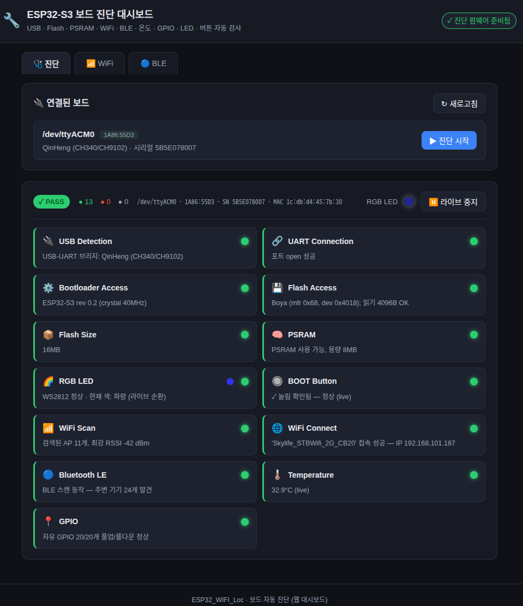
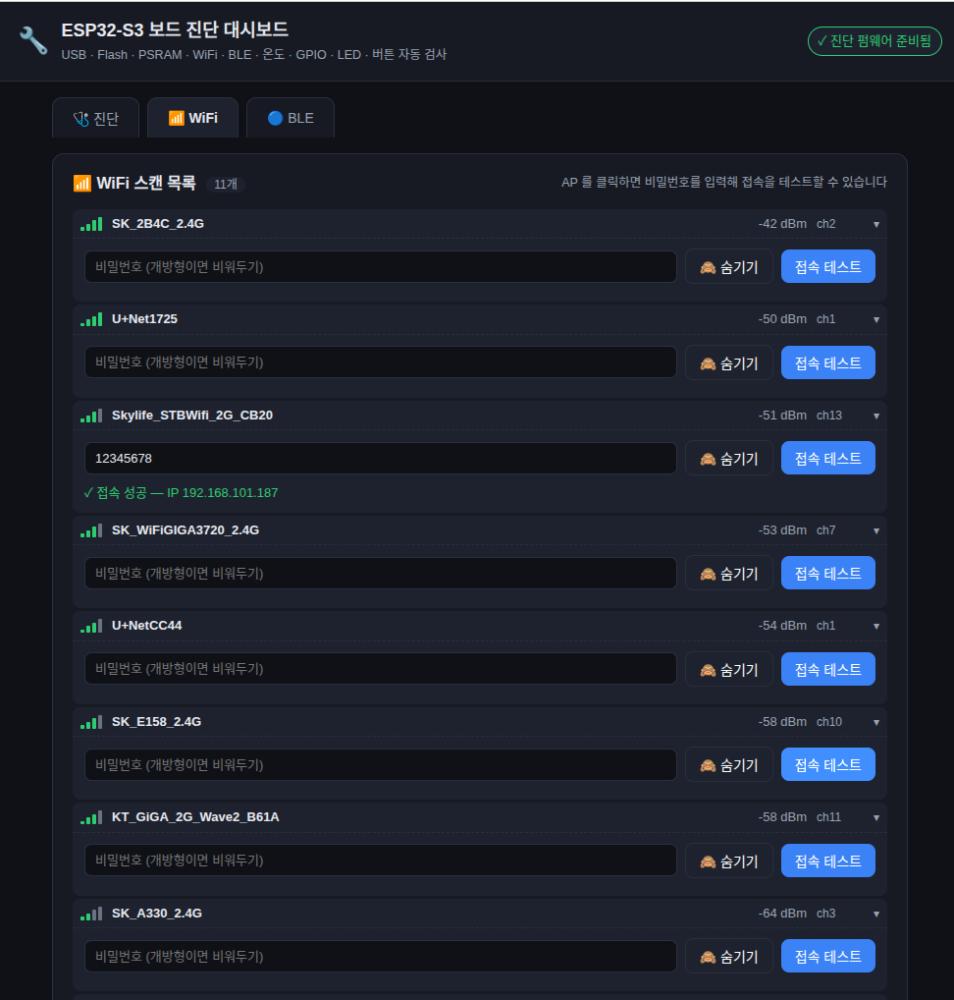
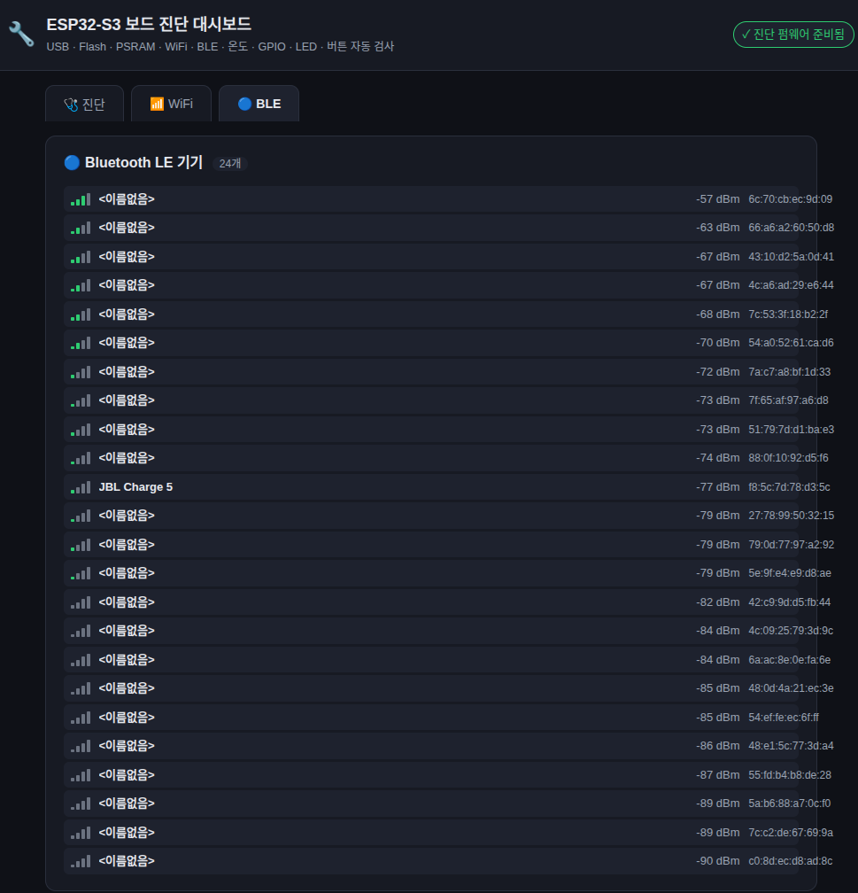

# ESP32-S3 진단 펌웨어

PSRAM, RGB LED, BOOT 버튼, WiFi 스캔/접속, **Bluetooth LE 스캔**, 내장 온도센서,
GPIO 점검 같은 검사는 칩에서 코드가 실제로 실행돼야 하므로(esptool 만으로는 불가),
이 작은 ESP-IDF 펌웨어를 보드에 올린 뒤 시리얼 출력을 호스트(`firmware.py`)가
파싱합니다.

---

## 진단 결과 화면 (웹 대시보드)

펌웨어가 출력한 `DIAG_*` 결과는 CLI 뿐 아니라 **웹 대시보드**로도 볼 수 있고,
탭에서 WiFi 접속·BLE 스캔 결과까지 대화형으로 확인할 수 있습니다.

### 진단 탭 — 전체 항목 PASS/FAIL 요약

USB·UART·부트로더·Flash·PSRAM·RGB LED·BOOT 버튼·WiFi·BLE·온도·GPIO 결과를
한눈에 보여주고, RGB LED 라이브 색 순환도 함께 표시합니다.



### WiFi 탭 — 스캔 목록 + 접속 테스트

검색된 AP 를 RSSI 순으로 나열하고, AP 를 클릭해 비밀번호를 입력하면 실제
접속(`DIAG_WIFI_CONNECT`)을 대화형으로 테스트할 수 있습니다.



### BLE 탭 — Bluetooth LE 기기 목록

주변에서 발견된 Bluetooth LE 기기를 RSSI 순으로 나열합니다.



---

## 가장 쉬운 방법: 2단계 스크립트 (권장)

보드의 **오른쪽 USB-C 포트(`COM`/CH343, `1A86:55D3`)** 에 케이블을 연결한 뒤,
저장소 루트에서 두 단계를 실행합니다.

```bash
# [1단계] 펌웨어 빌드 (최초 1회 — ESP-IDF 없으면 자동 설치)
bash tools/board_check/scripts/step01_build_diag_firmware.sh

# [2단계] 보드 진단 실행 (반복 실행 가능)
bash tools/board_check/scripts/step02_run_cli_based_diagnostics.sh
```

> 오른쪽 COM 포트가 플래시·로그에 가장 안정적입니다. 좌/우 구분은
> [docs/usb-ports.md](../../../docs/usb-ports.md) 참고.

**왜 둘로 나누나:** 빌드(느림, ESP-IDF 환경, 보통 1회)와 진단 실행(빠름, venv
환경, 반복)은 성격과 Python 환경이 달라서 분리했습니다. 펌웨어 소스를 고쳤을
때만 [1단계]를 다시 실행하면 됩니다.

### [1단계] `step01_build_diag_firmware.sh`

| 동작 | 내용 |
|------|------|
| 0 | ESP-IDF 설치 확인(없으면 `scripts/install_esp_idf.sh` 로 자동 설치) |
| 1 | `idf.py build` 로 펌웨어 빌드 |
| 2 | `idf.py merge-bin` 으로 병합 → `firmware/build/diag_merged.bin` 생성 |

### [2단계] `step02_run_cli_based_diagnostics.sh`

| 동작 | 내용 |
|------|------|
| 1 | 진단용 Python venv 준비(없으면 생성 + `requirements.txt` 설치) |
| 2 | `main.py --firmware` 실행 — flash 전체 erase → 펌웨어 다운로드 → **PSRAM / WiFi 스캔·접속 / Bluetooth LE / RGB LED / BOOT 버튼 / 온도센서 / GPIO 검사** |
| 3 | (기본 ON) **대화형 BOOT 버튼 검사** — 보드별로 "버튼 누르세요" 안내 후 실제 눌림 감지 |

자주 쓰는 옵션(모두 `main.py` 로 전달됨):

```bash
bash tools/board_check/scripts/step02_run_cli_based_diagnostics.sh --sudo            # 포트 권한 부족 시
bash tools/board_check/scripts/step02_run_cli_based_diagnostics.sh --port /dev/ttyACM0
bash tools/board_check/scripts/step02_run_cli_based_diagnostics.sh --no-button-test  # 대화형 버튼 검사 끄기
bash tools/board_check/scripts/step02_run_cli_based_diagnostics.sh --stress 100      # 스트레스 테스트
```

> ⚠️ [2단계]는 보드의 flash 를 **전체 erase** 한 뒤 진단 펌웨어로 덮어씁니다.
> 보드에 보존할 펌웨어/데이터가 있으면 먼저 백업하세요.

---

## 웹 대시보드로 진단하기 ([3단계], 선택)

CLI 대신 브라우저에서 진단하고 싶으면 [3단계] 스크립트로 웹 대시보드(FastAPI)를
띄웁니다. 위 [진단 결과 화면](#진단-결과-화면-웹-대시보드)의 진단/WiFi/BLE 탭이
이 대시보드입니다. 결과를 녹색/적색 동그라미로 보여주고, RGB LED 순환과 BOOT
버튼은 라이브로 갱신하며, WiFi 접속·BLE 스캔을 대화형으로 테스트할 수 있습니다.

```bash
# [1단계] 펌웨어 빌드는 동일하게 먼저 1회 (없으면 런타임 검사만 SKIP)
bash tools/board_check/scripts/step01_build_diag_firmware.sh

# [3단계] 웹 대시보드 기동
bash tools/board_check/scripts/step03_run_web_based_diagnostics.sh
# → 브라우저에서 http://127.0.0.1:8000 열기 (종료: Ctrl+C)

# 다른 PC 에서 접속하려면 바인드 주소/포트 지정:
HOST=0.0.0.0 PORT=9000 bash tools/board_check/scripts/step03_run_web_based_diagnostics.sh
```

> 웹 의존성은 `tools/board_check/requirements-web.txt`(FastAPI/uvicorn)에 있고,
> [3단계] 스크립트가 venv 에 진단·웹 의존성을 함께 설치합니다.

---

## 수동으로 단계별 실행하기

스크립트 대신 직접 단계를 밟고 싶을 때.

### 1) ESP-IDF 5.x 설치

```bash
bash scripts/install_esp_idf.sh          # ~/esp/esp-idf 에 설치(toolchain 포함)
# 수동 설치 시:
#   git clone -b v5.4 --recursive https://github.com/espressif/esp-idf.git ~/esp/esp-idf
#   ~/esp/esp-idf/install.sh esp32s3
source ~/esp/esp-idf/export.sh           # 새 터미널마다 실행 (IDF_PATH 설정)
```

### 2) 빌드 + 병합 바이너리 생성

진단 도구는 `firmware/build/diag_merged.bin` 하나(부트로더+파티션+앱 병합)를
`0x0` 에 flash 합니다. `step01_build_diag_firmware.sh` 가 빌드와
병합(`idf.py merge-bin`)을 함께 처리합니다.

직접 `idf.py` 로 하려면:

```bash
cd tools/board_check/firmware
idf.py set-target esp32s3
idf.py build
idf.py merge-bin -o build/diag_merged.bin
```

### 3) 진단 실행

```bash
source venv/bin/activate
python tools/board_check/main.py --firmware
```

### (선택) 도구 없이 직접 확인

ESP-IDF 환경에서 flash + 모니터를 직접 띄워 `DIAG_*` 라인을 눈으로 볼 수도
있습니다:

```bash
cd tools/board_check/firmware
idf.py -p /dev/ttyACM0 flash monitor
```

---

## 출력 규약

펌웨어는 부팅 후 아래 라인을 출력합니다(`firmware.py` 가 파싱):

검사는 부팅 시 1회만 수행해 결과를 보관하고, 아래 한 사이클(`DIAG_START` ~
`DIAG_DONE`)을 약 2초마다 반복 출력합니다(호스트가 늦게 연결해도 완전한 사이클을
받도록). RGB LED 는 매 사이클 R→G→B 로 순환 점등합니다.

```
DIAG_START
DIAG_CHIP         {"cores":2,"model":"ESP32-S3","revision":2}
DIAG_PSRAM        {"present":true,"size":8388608}
DIAG_LED          {"ok":true,"gpio":48,"color":"R"}
DIAG_BUTTON       {"idle_level":1,"pressed_now":false,"ever_pressed":false,"gpio":0}
DIAG_WIFI         {"ap_count":15,"strongest_rssi":-42,"aps":[{"ssid":"AP","rssi":-42,"ch":6}]}
DIAG_WIFI_CONNECT {"attempted":true,"connected":true,"ssid":"AP","ip":"192.168.0.10"}
DIAG_BLE          {"ok":true,"devices":3,"list":[{"addr":"..","rssi":-77,"name":"JBL"}]}
DIAG_TEMP         {"ok":true,"celsius":34.0}
DIAG_GPIO         {"ok":true,"tested":20,"passed":20,"failed":[]}
DIAG_DONE
```

> WiFi 접속(`DIAG_WIFI_CONNECT`)은 부팅 시 자동으로 하지 않는다. 호스트(웹/CLI)가
> 실행 시점에 `cli_wifi_config.yaml` 의 wifi.ssid/password 를 읽어 시리얼 `WIFI_CONNECT` 명령
> 으로 주입하면 그 결과가 여기 실린다(미설정/미주입이면 `attempted:false` → SKIP).

---

## WiFi 접속 테스트 & 시리얼 명령 처리 (구현 주의)

이 영역은 **타이밍 함정**이 많다(디버깅에 오래 걸린 부분). 코드를 고치기 전 아래를 숙지할 것.

### 명령/결과 규약
- 호스트 → 펌웨어: `WIFI_CONNECT <ssid>\t<password>\n` (UART0). 개방형 AP 는 password 생략.
- 펌웨어 → 호스트: 매 사이클 `DIAG_WIFI_CONNECT {...}`. `attempted:false` = 미주입/처리 전,
  `attempted:true,connected:true|false` = 결과. 실패 시 끊김 `reason` 을 동봉한다.

### ⚠️ 핵심: 직전 결과 오인 방지
`do_wifi_connect()` 는 **수 초 블로킹**이고, 그동안 메인 루프는 직전 결과(`g_wifi_conn_line`)를
~2초마다 계속 출력한다. 그대로면 호스트가 명령 직후 받은 결과를 **직전 시도의 것으로 오인**한다
("틀린 비번인데 성공", "맞는 비번인데 실패", "2번째는 정상"). 그래서:
- **펌웨어**: `handle_command` 가 명령 받자마자 결과를 `{"attempted":false}` 로 **무효화**하고,
  `do_wifi_connect` 완료 후 진짜 결과로 한 번에 교체한다.
- **호스트**: 무효화(`attempted:false`)를 **한 번 본 뒤의** `attempted:true` 만 진짜 결과로
  인정한다(`web/app.py` 의 `live_wifi["armed"]`, `web/static/app.js` 의 `pendingArmed`).

### 재전송 & 연쇄 방지
- 명령을 1회만 보내면 UART 타이밍으로 첫 전송이 유실돼 결과가 안 온다("두 번 눌러야 됨").
  → 응답이 올 때까지 ~2초마다 재전송한다(호스트, 횟수 제한 있음).
- 블로킹 중 쌓인 재전송이 같은 접속을 **연쇄 실행**하지 않도록, `serial_cmd_task` 가 처리 후
  `uart_flush_input(UART_NUM_0)` 로 입력 버퍼를 비운다.

### 끊김 reason
- 비번 오류는 칩/AP 에 따라 코드가 제각각이고 `reason 15`(4WAY_HANDSHAKE_TIMEOUT)는 진짜
  비번 오류와 일시적 실패가 섞여 나온다. → `hard_fail`(202 AUTH_FAIL / 201 NO_AP_FOUND /
  2 AUTH_EXPIRE)만 즉시 실패, 그 외는 retry 1회로 일시적 실패를 흡수한다(틀린 비번은 ~9초
  걸리지만 정확). 속도를 원하면 retry 를 0 으로 줄일 수 있으나 일시적 실패를 오판할 수 있다.

### 디버깅 (추측 금지)
직접 보드에 붙는 게 답이다: `esptool ... write_flash 0x0 build/diag_merged.bin` 로 flash,
`pyserial`(`ser.dtr=False; ser.rts=False` 로 리셋 방지 — 단 USB-Serial-JTAG 는 그래도 리셋될
수 있음)로 `WIFI_CONNECT` 를 **맞는/틀린 비번 연속**으로 보내며 `DIAG_*` + `ESP_LOGW` 로그를
캡처한다. 임시 `ESP_LOGW(TAG, "DBG ...")` 로 호출별 상태를 확인 후 제거한다.
- 펌웨어 수정 → **재빌드 + 재flash** 해야 반영(`step01` 빌드 → 웹 "진단 시작" 또는 step02 flash).
- `web/app.py` 등 Python 수정 → **uvicorn 재시작**(Ctrl+C 후 step03) 해야 반영(자동 리로드 아님).
- 포트 점유 확인: `fuser /dev/ttyACM0`.

---

## 펌웨어 빌드 없이 사용하려면

ESP-IDF 설치가 부담되면 `--firmware` 옵션을 빼고 실행하세요:

```bash
python tools/board_check/main.py
```

이 경우 PSRAM/WiFi/LED/버튼 항목은 `SKIP` 으로 표시되고, esptool 기반 하드웨어
검사(USB/UART/부트로더/Flash)는 모두 정상 수행됩니다.

---

## 관련 문서

- [보드 진단 도구](../README.md) — 진단 도구(CLI/웹) 사용법
- [펌웨어 가이드](../../../docs/firmware-guide.md) — MicroPython / ESP-IDF 펌웨어
- [Python 환경 두 개](../../../docs/python-environments.md) — 프로젝트 venv vs ESP-IDF venv
- [Espressif 생태계](../../../docs/espressif.md) — ESP-IDF·esptool·esp-csi 등 Espressif GitHub 저장소 정리
